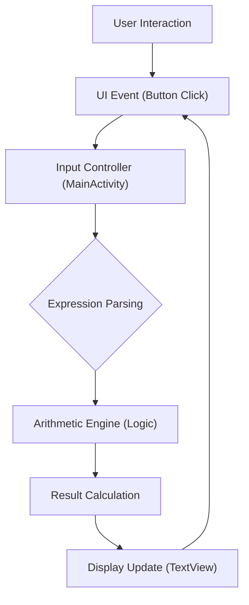

# Technical Specification: Android Studio Calculator

## Architectural Overview

**Android Studio Calculator** is a mobile application architecture designed to provide precise arithmetic calculations within a responsive Android environment. The application serves as a study into mobile interface design and logical state management, utilizing Java and XML-based layouts for high-performance execution on the Android platform.

### Arithmetic Logic Flow

---

## Technical Implementations

### 1. View Architecture
-   **Activity Model**: Built on the **Android Activity Lifecycle**, ensuring robust state persistence and resource management during mobile execution.
-   **XML Layouts**: Implements optimized XML-based UI definitions with **ConstraintLayout** for responsive geometry across various screen sizes and orientations.

### 2. Logic & Arithmetic
-   **Precision Execution**: Uses standard Java arithmetic primitives and logical operators to perform real-time calculations (Addition, Subtraction, Multiplication, Division).
-   **State Management**: Event-driven execution synchronized with UI lifecycle events, handling decimal inputs, operator precedence, and error states.
-   **Data Processing**: Synchronous architecture ensuring low-latency response critical for high-frequency input calculator interfaces.

### 3. Build & Deployment
-   **Gradle System**: The project utilizes the **Gradle Build Tool** to manage dependencies, compilation, and APK generation tasks.
-   **APK Generation**: Artifacts are compiled into signed/unsigned APKs for direct installation and testing on physical devices or emulators.

---

## Technical Prerequisites

-   **Runtime**: Android OS (API Level 21+).
-   **Development**: Android Studio Chipmunk or later, JDK 11+, and Android SDK.

---

*Technical Specification | Java / Android | Version 1.0*
